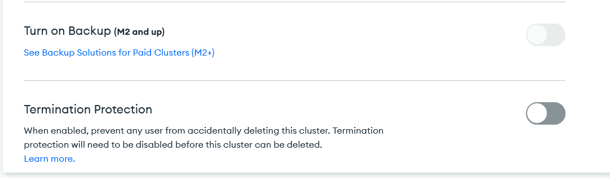
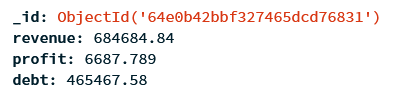

# DBAndCloudProject

This project represents a deployment of a cloud database (Atlas MongoDB) containing quarterly revenue reports. We connect through the database using python that is run on a kubernetes cluster. The python script will request the data and return an analysis. The actual analysis of the data and the data itself is conceptially and not meant to be fully fletched out applications.

This project also introduces CI/CD concepts. The project will automatically build the docker container, which holds our containerized python script, whenever a push happens to the github repository. Additionally, our docker image will be automatically uploaded to [``my docker hub``](https://hub.docker.com/repository/docker/nsff/dbandcloud/general). This allows the new docker image to be automatically useable in the deployment of a new kubernetes cluster.

# Software used

* Docker v24.0.4([install](https://docs.docker.com/engine/install/ubuntu/))
* Kubernetes v1.27.4 ([install](https://minikube.sigs.k8s.io/docs/drivers/docker/))
* Python~=3.8.0 ([install](https://www.python.org/downloads/))
* [Atlas MongoDB](https://www.mongodb.com/atlas/database) (cloud hosted MongoDB)

# Environment setup

Use the [``environment.yml``](environment.yml) to install your local python env. ([``requirements.txt``](requirements.txt) Is used to create the docker image and doesn't contain the python version that I used.)

If you want to execute the python script to your minikube. You will have to install minikube and docker. Follow the following steps to execute the script on a minikube cluster.

* Make sure the docker service is started, if not use the following command: ``sudo service docker start``
* Start minikube: ``minikube start``
    * If docker images permission denied, execute this command: ``sudo usermod -aG docker $USER && newgrp docker``
* (Start the dashboard: ``minikube dashboard``)
* Pull our image on docker hub and deploy it on our minikube: [``./k8Deploy.sh``](./bashScripts/k8AppDeploy.sh)
    * If anything goes wrong here, it might be that the deployment already exists (Execute ``kubectl delete deployment dbandcloud`` to delete the existing deployment) OR something else might be wrong. An alternative might be to allow minikube/kubectl to access local docker images and pull the image to docker first. For this you can follow the guide [here](https://minikube.sigs.k8s.io/docs/handbook/pushing/#1-pushing-directly-to-the-in-cluster-docker-daemon-docker-env)

# Database

Atlas MongoDB (hosted on Google Cloud) was used for this project with an M0 (Free) database. As it is a free version, it restricts the options we have for data management/governance. We would need to upgrade to M2/M5/M10 for all the best practices to be implemented, which quickly adds to our expenses as a student.

Instead I will show what we would have turned on.

* I would have turned on the [backup options](https://www.mongodb.com/docs/atlas/backup-restore-cluster/#backup-methods). Both the Serverless Continuous Backup and Basic backups. But it depends on the use case. Our use case handles financial revenue data that only updates once very quarter where the whole database might be read and analyzed every quarter. That's why we will need full database backups or partial backups of most recent (2-3 year) data.
    * The serverless option allows us to go back to full snapshots up to 35 days, which gives us breathing room if mistakes happen and are not immediately noticed. I did not immediately find back options for older than 35 days, but I assume it is possible. This would also be a better option for our use case.
    * The Basic backup options are great for development and deployment purposes, as it only keeps the 2 most recent backups in the past 12 hours. This allows us to deploy or test and revert back to a very recent working version.
    * We could also think about adding database logging. For any event that happens with the database. I see mainly uses for our use case for whenever new data is added or changed/deleted. + Whenever data is being read and who is connecting and when to our database. Additionally, we should monitor/log the performance of the servers hosting and serving our database. This could allow us to notice abnormalities of our database throughput.

* I would also turn on Termination protection to avoid accidental deletion of our database. (see image below)

As this projects focus is more about best practices, deployment and CI/CD, we will not have very elaborate data or applications running in our project. An example of our dummy data looks like this:

# Database Access

We use the following user (``read_service_account``) to access the mongoDB with restricted access:
* Has only Read permission
* Can only access the used MongoDB database used in this project, called DBAndCloud
* Username and passwords are stored in github secrets which is used during docker build.

# Containerization

My application currently creates only 1 docker image. This script automatically connects and analyzes the data to our MongoDB. There is however a different more common approach to do this. Often companies would make an API to the MongoDB and containerize this. The API would be added to a namespace within the kubernetes cluster. However, I opted out of this solution as we are only interested in Reading ALL the data for our use case and developing an API would be overkill. But it is best practice to containerize and develop an api for it. (Atlas MongoDB also allows for automatic CRUD API creation and hosting. This would have also solved the issue but wouldn't have used our kubernetes cluster.)

# Docker Access

Docker username and password + database username and password are stored in github secrets and used during build with github actions

# CI/CD

* Docker automatic build and push to [``my docker hub``](https://hub.docker.com/repository/docker/nsff/dbandcloud/general) when file within src folder changes

# Security Risk issue

The github secrets are passed along to the github actions script which build the docker container and uploads it. The problem is, I need the variables of the mongoDB ``read_service_account`` in my python script. The right way to do it, is to build the docker image and use docker secrets. This however brought a lot of issues whith my github action script not passing along the variables. So I decided to use the docker build-arg command. This is a less secure way of using the variables. It could for example be detected in the container logs, or accidentally exposed if a user asks environment variables. (It's still better than nothing, but should be kept in mind)

A fix to this is, to keep the location of where the docker secrets are stored and retreive the secret variables out of that file.

# References

Here is a list of references I used to fix bugs and implement the project:

* Fix docker install and run bug: https://askubuntu.com/questions/1379425/system-has-not-been-booted-with-systemd-as-init-system-pid-1-cant-operate
* Fix minikube not using docker driver by default: https://minikube.sigs.k8s.io/docs/drivers/docker/
* Docker make dockerfile tutorial: https://www.youtube.com/watch?v=LQjaJINkQXY
* Docker push to docker hub: https://www.youtube.com/watch?v=EIHY_CY5J0k
* Use image in minikube: https://minikube.sigs.k8s.io/docs/handbook/pushing/
* Docker install additional python libraries: https://stackoverflow.com/questions/50333650/install-python-package-in-docker-file
* Helped in debugging/testing minikube pod: https://www.youtube.com/watch?v=wQRqTAW27oQ
* Use local docker image in minikube: https://stackoverflow.com/questions/42564058/how-to-use-local-docker-images-with-minikube
* Github actions only execute on folder specific changes: https://stackoverflow.com/questions/63822219/how-to-run-github-actions-workflow-only-if-the-pushed-files-are-in-a-specific-fo
* Github actions build docker and push to hub: https://docs.github.com/en/actions/publishing-packages/publishing-docker-images
* Github actions basics: https://docs.github.com/en/actions/learn-github-actions/understanding-github-actions
* Github actions, dockerfile should not use workdir: https://docs.github.com/en/actions/creating-actions/dockerfile-support-for-github-actions
* Debugging decimal128 to float conversion in python: https://www.appsloveworld.com/pandas/100/274/how-to-convert-decimal128-to-decimal-in-pandas-dataframe
* MongoDB python documentation: https://www.mongodb.com/docs/drivers/python/
* Using github secrets in python: https://medium.datadriveninvestor.com/accessing-github-secrets-in-python-d3e758d8089b